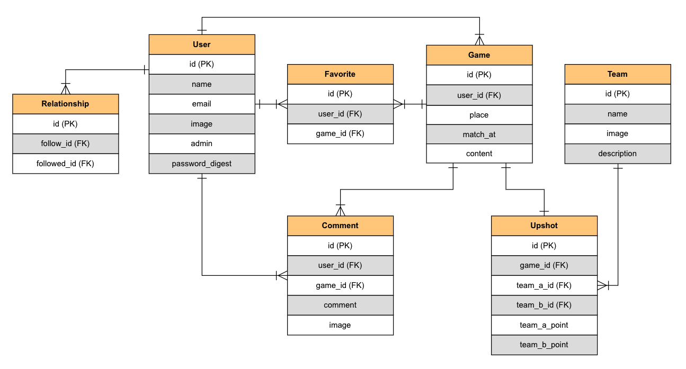
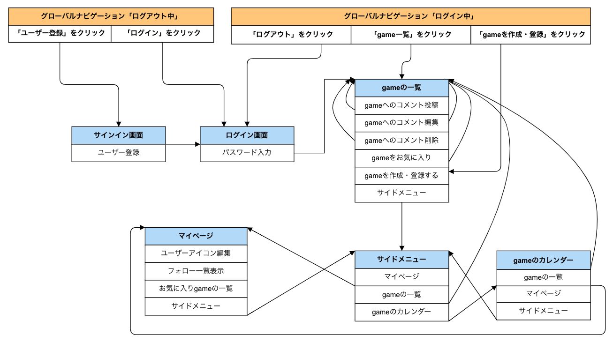

## タイトル  
SoccerPub

## コンセプト  
#### サッカー好き達の交流プラットフォーム

インターネット上に点在する欧州サッカー好きが横の繋がりを構築できる場所を提供することが目的。			
近年スポーツ観戦に関するサブスクリプションサービスの普及に伴い、日本にも欧州サッカーを観戦する人口は増加している。			
一方、現地に足を運ぶことができないサポーターはTwitterなどで能動的に動かなければその熱狂を誰にも共有できない。			
SoccerPubはそんな熱のあるサポーター達にとって、「ここに来れば、仲間が待っている。」そんな場所になります。			
試合(game)ごとに交流や情報収集を行うことができる。			
遠く離れたクラブを応援する同胞と出会い、熱狂を共にすることが叶うプラットホーム。			

## バージョン
* Ruby2.6.5
* Rails5.2.5
* PostgreSQL13.2

## 機能一覧
* gameのCRUD機能(投稿・画像、編集、削除)
* gameのお気に入り機能
* お気に入り一覧表示機能
* コメント機能
* ユーザー登録機能
* ユーザー管理機能
* ログイン機能
* ゲストログイン機能
* フォロー機能
* 管理者権限機能
* game検索機能
* Heroku

## カタログ  
https://docs.google.com/spreadsheets/d/14LryNe5jRJ_aXTc7gwYj9obVwUx2zzTddIJnwSfIuZ8/edit?usp=sharing

## テーブル定義・ER図
https://docs.google.com/spreadsheets/d/1_d_FzBvuZ7axLwPxXkG3uJficT9CjFV9zp3jkyFCrfE/edit?usp=sharing

## ワイヤーフレーム
https://docs.google.com/spreadsheets/d/1FkJdZkb0pOO_bFkr_4-wOa1713wLZ8-hFA6XVzkpO-M/edit?usp=sharing

## ER図
  

## 画面遷移図
  